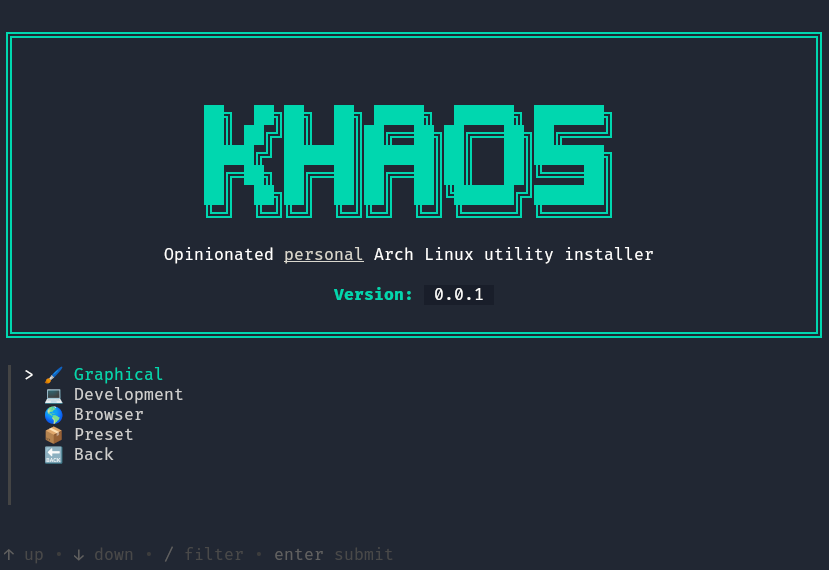

# Khaos



**Khaos** ([χάος](<https://en.wikipedia.org/wiki/Chaos_(cosmogony)>), from the greek mithology) is a personal project aimed at providing a simple and easy way to install Arch Linux on a new system.

All scripts are written in Bash and use [Gum](https://github.com/charmbracelet/gum) for the user interface.\
Everything is configurable and can be easily customized.

## Installation

### Arch Linux

Clone the repo:

```sh
git clone https://github.com/MrLucio/khaos.git
```

Change directory:

```sh
cd khaos
```

Run the installer:

```sh
./install.sh
```

## TODO

- [ ] Add support for other package managers
- [ ] Increase support for GNOME
- [ ] Add Development section
- [ ] Add Browser section
- [ ] Add Preset section
- [ ] Improve error management
- [ ] Add more customization options
- [ ] Add more documentation
